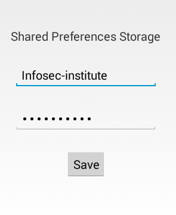
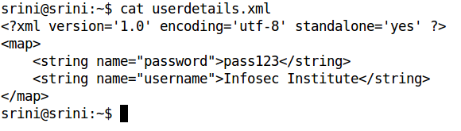
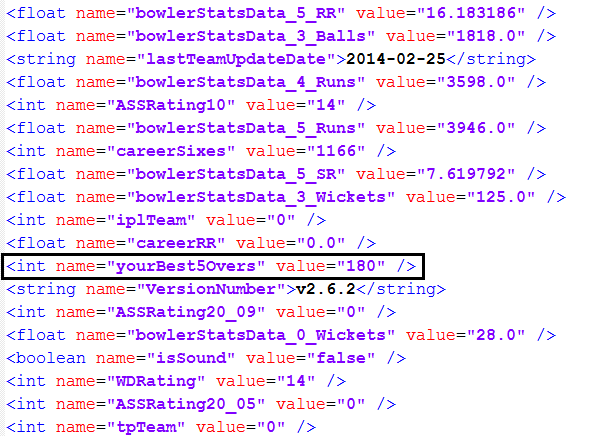

#一种针对已ROOT的Android设备的隐私数据保护方案的设计与实现
**摘要:**2008年Google发布了Android（备注？）操作系统。得益于其开放性，Android操作系统迅速成为了最流行的手机操作系统。据国外著名统计机构IDC的调查显示，Android已经占据了82.8%的手机智能操作系统市场份额。（http://www.idc.com/prodserv/smartphone-os-market-share.jsp）然而，也正是因为其开放性，Android所面临的安全威胁越来越来严重，据360公司发布的安全报告称：其安全中心监测到平均每天截获新增手机恶意程序样本近 6.04 万个。累计监测到移动端用户感染恶意程序 6573 万人次，平均每天恶意程序感染量达到了 72.2 万人次[2015 年第二季度中国手机安全状况报告]。由此可见Android操作系统面临着严重的安全威胁。当然，针对Android安全方面的研究也成为了近几年学术界和产业界的热点。
据腾讯安全实验室发布的 2014年手机ROOT安全报告显示，为追求Android系统更高的可玩性或者删除手机系统上不需要的软件等，许多用户选择ROOT手机，ROOT手机用户也在快速增长，ROOT用户目前已占据Android用户总数的27.44%。[腾讯手机ROOT安全报告]

##选题背景
得益于其开放性，Android操作系统已成为当下最流行的手机操作系统。据国外著名统计机构IDC的调查显示，Android已经占据了82.8%的手机智能操作系统市场份额[引用1]。Android系统为了提高安全性，主要提供了两层安全特性：

1. Linux内核提供的基于用户的应用沙箱
	Android将每个应用都当作一个新用户，并为其分配一个低权限的用户ID，每个应用都运行在一个单独的虚拟机中，并且只可以访问属于自己的文件。
2. Android系统新增的应用权限申请-用户授权的权限模型。
	Android平台上，每个应用都需要声明所用到的权限，当应用安装时，由用户决定是否授权，正常情况下，应用无法执行未授权的操作。
	
当Android设备被ROOT后，恶意软件可以轻松获得ROOT权限，导致第一层安全特性完全失效，恶意软件可以访问其他任何应用的私有文件，引发严重安全问题。

### 被ROOT的设备越来越多
市场上发售的Android手机，绝大度多数都预装了各种各样的应用软件，平均每部拥有8.2个预装软件[1]，严重影响用户手机使用。为了卸载这些预装软件，唯一的办法就是将手机ROOT，然后用相关工具进行卸载。此外，一些极客用户为了获得对手机的更多控制，也选择将手机进行ROOT。据腾讯发布的ROOT安全报告显示，ROOT手机用户正在快速增长，ROOT用户目前已占据Android用户总数的27.44%[2]。
### ROOT之后，Android设备面临严重的安全威胁
由于Android操作系统是基于Linux操作系统发展而来，其ROOT权限是系统的最高权限，拥有ROOT权限，即意味着拥有整个系统的绝对控制权。正常情况下，Android系统仅允许极少的应用程序拥有ROOT权限。当用户将手机ROOT之后，恶意程序将有可能获得ROOT权限，对用户的数据安全造成严重威胁，主要体现在如下两个方面。

1. 用户个人隐私数据安全

	用户个人的隐私数据包括联系人信息、短信信息、照片等等，当恶意程序拥有了ROOT权限之后，很容易获得这些个人信息，进而进行各种更有威胁的操作，如恶意扣费等。
2. 第三方应用私有数据安全

	Android系统中，每个应用都拥有一个私有目录，该目录用户存储该应用的私有信息，如配置信息等。Android提供的Sharedpreferences是开发者最常用的简单信息存储工具，其会将数据以key-value的形式保存在应用目录下的xml文件中，其中的数据全部以明文存在。   
	当恶意程序拥有ROOT权限之后，可以方便地获取到其他应用的隐私数据，进而可以篡改应用的配置，窃取用户信息等。

### 很多第三方应用没有采取适当措施保护其隐私数据
由于Android应用开发门槛较低，导致Android开发人员素质稂莠不齐，很多开发人员没有重视应用所面临的安全威胁，对应用的配置信息等没有做加密处理，而是直接明文存储。下面是三种典型的安全示例：

1. 用户隐私数据泄露[3]

	由于Android提供的SharedPreferences使用简单，故很多开发者将其作为存储用户数据的首选，但并没有对所存储的数据进行加密处理，当手机被ROOT之后，其存储的信息非常容易被获取。   
	很多开发者会采用图1、图2所示的方式保存用户的用户名、密码等信息，这些用户信息没有进过加密处理，会直接以明文的方式存储在文件中。
	
	   
	图1   
	
	   
	图2   
	
	当恶意应用获得ROOT权限之后，将能读取该文件，结果将导致用户隐私信息的泄露，如图3所示。   
	   
	图3
	
2. 应用数据被篡改[3]

	TODO 改成coacht修改进度   
	
	Android应用的各种私有信息，如配置信息等，也常通过SharedPreferences来进行存储，当恶意应用获得ROOT权限之后，将能够对这些信息进行篡改。   
	CoachT是一款热门的健身收费-返现健身应用，当用户完成训练之后，可以获得返现。其通过SharedPreferences存储当前训练进度，如图3、图4所示。   

	   
	图4   
	   
	图5   
	当恶意程序获取到ROOT权限之后，其可以修改当前训练的进度信息，快速完成训练，如图6所示。   
	   
	图6   
	
	
3. 窃取应用隐私，并攻击相关服务

	还是上节提到的CoachT应用，其采用七牛[引用]作为云存储服务器，用户训练过程中产生的图片等资源，全都上传到七牛服务器。而七牛提供的上传接口需要一个token字段，来进行合法性验证，而该字段也采用了SharedPreferences的方式存储，当恶意应用获得ROOT权限之后，可轻松获取该token，如图7所示。token泄露之后，意味着别人可以使用属于的你存储空间，并产生大量资费， 如图8所示。   
	   
	图7   
	   
	图8
	

### 需求和课题意义
近年来，由于Android超高的市场占有率和严重的安全问题，Android安全一直是业界的研究热点，但研究主要集中在完善Android权限系统（Permission System）和针对未ROOT的Android设备的隐私保护。   
随着Android设备ROOT的用户的不断增加，ROOT将带来越来越严重的安全威胁，不但威胁到普通用户的隐私数据安全，同时还威胁到第三方开发者的应用数据安全。本课题将针对已ROOT的Android设备，研究用户隐私和第三方应用的隐私保护方案，减少因为ROOT带来的用户隐私泄露和针对第三方应用的攻击。

##国内外研究现状
### 研究现状

TODO 参考文献不够，去看那3篇和ROOT相关的文献的参考文献。
扩展Android的权限机制，防止用户隐私（如联系人信息等）泄露和阻止用户未授权的行为（如拨打电话灯）
SharedPreferences保护方案

为了应对Android面临的安全威胁，Android安全是近年来的研究热点，这些研究大体可以分为两类：Android权限管理系统的增强、针对权限提升攻击的检测与防护和针对已ROOT设备的安全防护方案。其中，前两类研究，已经比较成熟，而最后一类研究尚在起步阶段，相关研究比较少。这两类研究的目标都是保护用户数据安全和防止造成经济损失。

第一类，Android权限管理系统的增强。由于Android的权限模型采用的是All-or-Nothing模式，用户安装应用时要么接受所有的权限申请，要不放弃安装。这类研究，主要研究如何允许用户只对应用进行部分授权，以防止应用被过度授权。

第二类，针对权限提升攻击的检测与防护。这类研究，主要研究如何检测应用是否有权限提升攻击的风险，和如何防止权限提升攻击。

第三类，针对已ROOT设备的安全防护。由于当Android设备被用户ROOT之后，前面两类研究提出的种种安全方案都将失效，本类研究主要研究Android设备被ROOT之后，如何去保证数据安全。文献[9]列举了Android自带权限模型的三个弱点，并指出了当Android被ROOT之后，恶意软件可针对前面提出的三个弱点的两种攻击方法。文献[12]是基于文献[9]而展开的研究，针对文献[9]指出的三个弱点，分别提出了相应的保护方案。文献[8]首先指出了ROOT带来的一系列安全威胁，然后提出了一种增强的ROOT管理框架ROOTGuard，该框架会实时监控已授予ROOT权限的应用的行为，并根据用户设定的策略，决定是否对当前行为进行授权。

针对已ROOT设备的安全防护方面的研究，现在还比较少，且考虑的安全威胁不够全面，比如现在尚未有考虑第三方应用数据安全方面的研究，但随着已ROOT的Android设备越来越多，这方面的研究，将成为未来Android安全研究的一个重要方面。

### 目前研究中存在的问题
当前Android安全方面的研究，虽然热门，但有两方面的问题被忽视了。

1. 没有考虑ROOT带来的风险

	当前，Android安全方面的研究，大多基于恶意软件不能获得ROOT权限的假设，没有考虑ROOT带来的风险，但随着越来越多的设备被ROOT，据腾讯安全实验室发布的 2014年手机ROOT安全报告显示，ROOT用户目前已占据Android用户总数的27.44%。[腾讯手机ROOT安全报告]。当恶意软件能获得ROOT权限之后，其对系统带来的安全威胁将更加严重。
2. 没有考虑第三方应用面临的安全威胁

	当大家的目光都集中在如何保护普通用户的隐私安全上的时候，一种针对第三方应用的新型的攻击方式，已经慢慢流行开来。由于Android应用开发门槛较低，开发人员的安全意识不强烈，第三方应用极易留下安全漏洞。这些安全漏洞，一旦被恶意软件利用，将产生三方面的安全问题：用户隐私泄露、应用数据被篡改、开发者后台服务被攻击。

##研究内容
### 研究的目标
本课题主要研究针对已ROOT的Android设备的安全防护方案，该安全防护方案旨在保护用户隐私的同时，保护第三方应用免遭恶意软件的安全攻击。
###技术路线
具体而言，主要的研究工作将通过以下几个部分来完成。

1. 分析用户对Android设备进行ROOT的动机   

	对Android设备进行ROOT，本身就具有一定的复杂度，但越来越多的用户还是选择ROOT，那么肯定有强烈的动机驱动他们，只有了解了这种动机，在研究中去满足用户有意义的需求，才能使本课题的研究更有意义

2. 研究ROOT对Android设备带来的威胁

	Android设备被ROOT后，恶意软件将很容易获得ROOT权限。拥有ROOT权限的恶意软件和没有ROOT权限的恶意软件相比，其攻击模型就会发生一些变化，只有清楚了新的攻击模型，才能继续本课题的研究工作。
2. 研究在ROOT环境下，如何保护用户隐私安全和第三方应用数据安全

	这是本课题的研究重点，既然对Android设备进行ROOT是用户的一种强需求，本课题将研究如何在ROOT环境下，保护用户隐私安全和第三方应用数据安全。
3. 开发、测试和性能评估

	为了方便本课题所研究的方案的部署和推广，研究后期，将开发一套一键部署工具，普通用户安装改工具之后，不但能继续使用ROOT带来的各种便利，还得保护个人或第三方应用的数据安全。

###研究中的关键点和难点
本课题的关键点和难点主要有以下几点：

1. 如何拦截恶意软件对用户隐私文件和第三方应用的私有数据的访问。
2. 如何保证用户授权的软件（如：安全软件）能访问其他软件的私有文件。
3. Android设备型号和版本众多，如何保证兼容性。

##研究方案
###研究方案
目前，已经构想了一套方案，大体原理如下：

1. Android系统中，每个应用相当于一个用户，是其所有私有文件的所有者。
2. 正常情况，ROOT用户拥有系统最高权限，能访问所有其他用户的文件。本课题将在ROOT用户执行对文件的访问操作时，判断是否为文件的所有者。是，则可以访问；否，则不可以访问。如下图所示：todo
3. 为了让特殊应用有权访问非其所有的文件，可以采用一套白名单方案。

###相关工作基础
目前，在理论和实践方面都已经有了一定的工作基础，从而能保证相关研究的顺利进行。具体来说：

1. 阅读大量Android安全相关的文献，对Android安全有一定的认识。
2. 熟悉Linux系统，能深入研究底层访问拦截机制。
2. 一直从事Android相关开发工作，能完成课题的开发工作。

##预期成果和可能的创新点
1. 最高预期成果
	
	本课题提出的方案，被Google公司采用，纳入Android安全体系，更大范围保护用户隐私和第三方应用的数据安全，以及第三方应用开发者的权益。
1. 最低预期成果
	
	完成课题提出的方案的研究、验证工作，并开发出一款安全工具，提交应用市场，供用户下载使用。
1. 可能的创新的
	* 通过文件属性来保护第三方应用的数据安全

	
##研究计划
1. 2015年10月~2015年12月   

	系统调查用户的ROOT需求，和ROOT对Android设备带来的风险，阅读现有的Android安全相关文献，学习Linux访问拦截机制，为深入研究做准备。
2. 2016年1月~2016年2月

	总结现有Android安全方案的优缺点，细化本课题的具体方案和技术路线，为下阶段的研究实现打下坚实的基础。
3. 2016年3月~2016年5月

	研究实现针对已ROOT的Android设备的安全方案，并进行性能、兼容性等各方面的评估。
4. 2016年6月~2016年7月

	撰写毕业论文，准备毕业答辩。

##参考文献
1. 中国Android手机预装产业及用户 使用情况研究报告
2. 2014年手机ROOT安全报告
3. Insecure Local Storage: Shared Preferences - InfoSec Resources(网页，为知收藏)
4. IDC调查报告（http://www.idc.com/prodserv/smartphone-os-market-share.jsp）
5. Android访问控制机制安全增强方案
7. An Android Security Extension to Protect Personal Information against Illegal Accesses and Privilege Escalation Attacks
8. Anroid权限提升漏洞攻击的检测
11. RootGuard: Protecting Rooted Android Phones
12. Once Root Always a Threat: Analyzing the Security Threats of Android Permission System
13. android系统上权限提升的安全增强框架
14. Privilege Escalation Attacks on Android
13. Before Unrooting your Android Phone, Patching up Permission System First
14. Android权限提升攻击检测技术的研究
14. 以下为未读
15. LifeHacker: Top 10 reasons to root your android phone, http://lifehacker.com/ top-10-reasons-to-root-your-android-phone-1079161983
16. Nauman, M., Khan, S., Zhang, X.: Apex: extending android permission model and enforcement with user-defined runtime constraints. In: 5th ACM CCS (2010)
17. Au, K.W.Y., Zhou, Y.F., Huang, Z., Lie, D.: Pscout: analyzing the android per- mission specification. In: ACM CCS (2012)
18. Davi, L., Dmitrienko, A., Egele, M., Fischer, T., Holz, T., Hund, R., Nu ̈rnberger, S., Sadeghi, A.R.: Mocfi: A framework to mitigate control-flow attacks on smart- phones. In: NDSS (2012)
19. Analyzing Inter-application Communication in Android
20. Android Permissions Demystified,
21. RGBDroid:anovelresponse-basedapproachto android privilege escalation attacks.
22. Dissectingandroidmalware:Characterizationandevolution
23. Android. Android open source project, android security overview
24. Apex: extending Android permission model and enforcement with
user-defined runtime constraints
