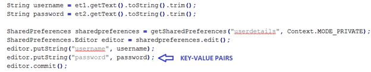

#一种针对已ROOT的Android设备的隐私数据保护方案的设计与实现
**摘要:**2008年Google发布了Android（备注？）操作系统。得益于其开放性，Android操作系统迅速成为了最流行的手机操作系统。据国外著名统计机构IDC的调查显示，Android已经占据了82.8%的手机智能操作系统市场份额。（http://www.idc.com/prodserv/smartphone-os-market-share.jsp）然而，也正是因为其开放性，Android所面临的安全威胁越来越来严重，据360公司发布的安全报告称：其安全中心监测到平均每天截获新增手机恶意程序样本近 6.04 万个。累计监测到移动端用户感染恶意程序 6573 万人次，平均每天恶意程序感染量达到了 72.2 万人次[2015 年第二季度中国手机安全状况报告]。由此可见Android操作系统面临着严重的安全威胁。当然，针对Android安全方面的研究也成为了近几年学术界和产业界的热点。
据腾讯安全实验室发布的 2014年手机ROOT安全报告显示，为追求Android系统更高的可玩性或者删除手机系统上不需要的软件等，许多用户选择ROOT手机，ROOT手机用户也在快速增长，ROOT用户目前已占据Android用户总数的27.44%。[腾讯手机ROOT安全报告]

腾讯安全实验室发布的 2014年第一期手机ROOT安全报告
##选题背景
### 被ROOT的设备越来越多
市场上发售的Android手机，绝大度多数都预装了各种各样的应用软件，平均每部拥有8.2个预装软件[1]，严重影响用户手机使用。为了卸载这些预装软件，唯一的办法就是将手机ROOT，然后用相关工具进行卸载。此外，一些极客用户为了获得对手机的更多控制，也选择将手机进行ROOT。据腾讯发布的ROOT安全报告显示，ROOT手机用户正在快速增长，ROOT用户目前已占据Android用户总数的27.44%[2]。
### ROOT之后，Android设备面临严重的安全威胁
由于Android操作系统是基于Linux操作系统发展而来，其ROOT权限是系统的最高权限，拥有ROOT权限，即意味着拥有整个系统的绝对控制权。正常情况下，Android系统仅允许极少的应用程序拥有ROOT权限。当用户将手机ROOT之后，恶意程序将有可能获得ROOT权限，对用户的数据安全造成严重威胁，主要体现在如下两个方面。

1. 用户个人隐私数据安全

	用户个人的隐私数据包括联系人信息、短信信息、照片等等，当恶意程序拥有了ROOT权限之后，很容易获得这些个人信息，进而进行各种更有威胁的操作，如恶意扣费等。
2. 第三方应用私有数据安全

	Android系统中，每个应用都拥有一个私有目录，该目录用户存储该应用的私有信息，如配置信息等。Android提供的Sharedpreferences是开发者最常用的简单信息存储工具，其会将数据以key-value的形式保存在应用目录下的xml文件中，其中的数据全部以明文存在。   
	当恶意程序拥有ROOT权限之后，可以方便地获取到其他应用的隐私数据，进而可以篡改应用的配置，窃取用户信息等。

### 很多第三方应用没有采取适当措施保护其隐私数据
由于Android应用开发门槛较低，导致Android开发人员素质稂莠不齐，很多开发人员没有重视应用所面临的安全威胁，对应用的配置信息等没有做加密处理，而是直接明文存储。下面是三种典型的安全示例：

1. 用户隐私数据泄露[3]

	由于Android提供的SharedPreferences使用简单，故很多开发者将其作为存储用户数据的首选，但并没有对所存储的数据进行加密处理，当手机被ROOT之后，其存储的信息非常容易被获取。   
	很多开发者会采用图1、图2所示的方式保存用户的用户名、密码等信息，这些用户信息没有进过加密处理，会直接以明文的方式存储在文件中。
	
	   
	图1   
	
	   
	图2   
	
	当恶意应用获得ROOT权限之后，将能读取该文件，结果将导致用户隐私信息的泄露，如图3所示。   
	   
	图3
	
2. 应用数据被篡改[3]

	TODO 改成coacht修改进度   
	
	Android应用的各种私有信息，如配置信息等，也常通过SharedPreferences来进行存储，当恶意应用获得ROOT权限之后，将能够对这些信息进行篡改。   
	CoachT是一款热门的健身收费-返现健身应用，当用户完成训练之后，可以获得返现。其通过SharedPreferences存储当前训练进度，如图3、图4所示。   

	   
	图4   
	   
	图5   
	当恶意程序获取到ROOT权限之后，其可以修改当前训练的进度信息，快速完成训练，如图6所示。   
	   
	图6   
	
	
3. 窃取应用隐私，并攻击相关服务

	还是上节提到的CoachT应用，其采用七牛[引用]作为云存储服务器，用户训练过程中产生的图片等资源，全都上传到七牛服务器。而七牛提供的上传接口需要一个token字段，来进行合法性验证，而该字段也采用了SharedPreferences的方式存储，当恶意应用获得ROOT权限之后，可轻松获取该token，如图7所示。token泄露之后，意味着别人可以使用属于的你存储空间，并产生大量资费， 如图8所示。   
	   
	图7   
	   
	图8
	

### 需求和课题意义
近年来，由于Android超高的市场占有率和严重的安全问题，Android安全一直是业界的研究热点，但研究主要集中在完善Android权限系统（Permission System）和针对未ROOT的Android设备的隐私保护。   
随着Android设备ROOT的用户的不断增加，ROOT将带来越来越严重的安全威胁，不但威胁到普通用户的隐私数据安全，同时还威胁到第三方开发者的应用数据安全。本课题将针对已ROOT的Android设备，研究用户隐私和第三方应用的隐私保护方案，减少因为ROOT带来的用户隐私泄露和针对第三方应用的攻击。

##国内外研究现状
### 研究现状
目前，针对Android安全方面的研究主要集中在Android权限系统的增强和针对非ROOT设备的个人隐私数据的保护。
### 目前研究中存在的问题

##研究内容
### 研究的目标
###技术路线
###研究中的关键点和难点

##研究方案
###研究方案
###相关工作基础

##预期成果和可能的创新点
TODO
##研究计划
TODO
##参考文献
1. 中国Android手机预装产业及用户 使用情况研究报告
2. 2014年手机ROOT安全报告
3. Insecure Local Storage: Shared Preferences - InfoSec Resources(网页，为知收藏)
